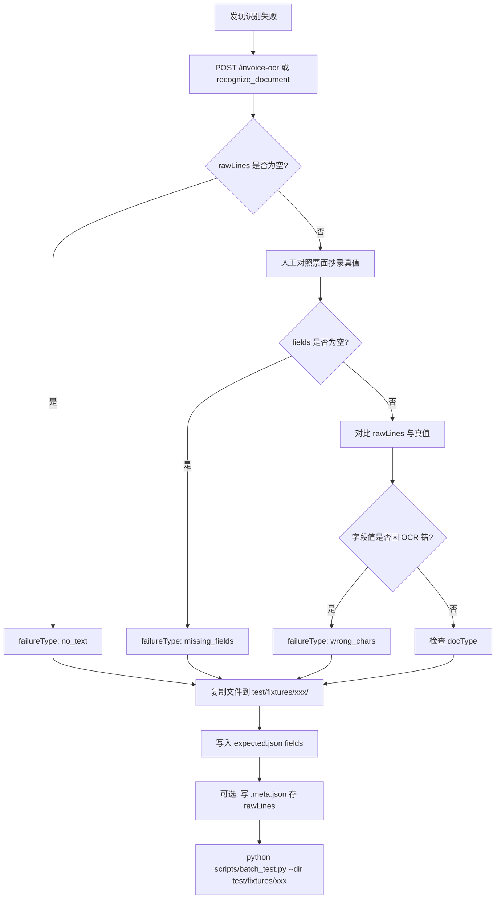
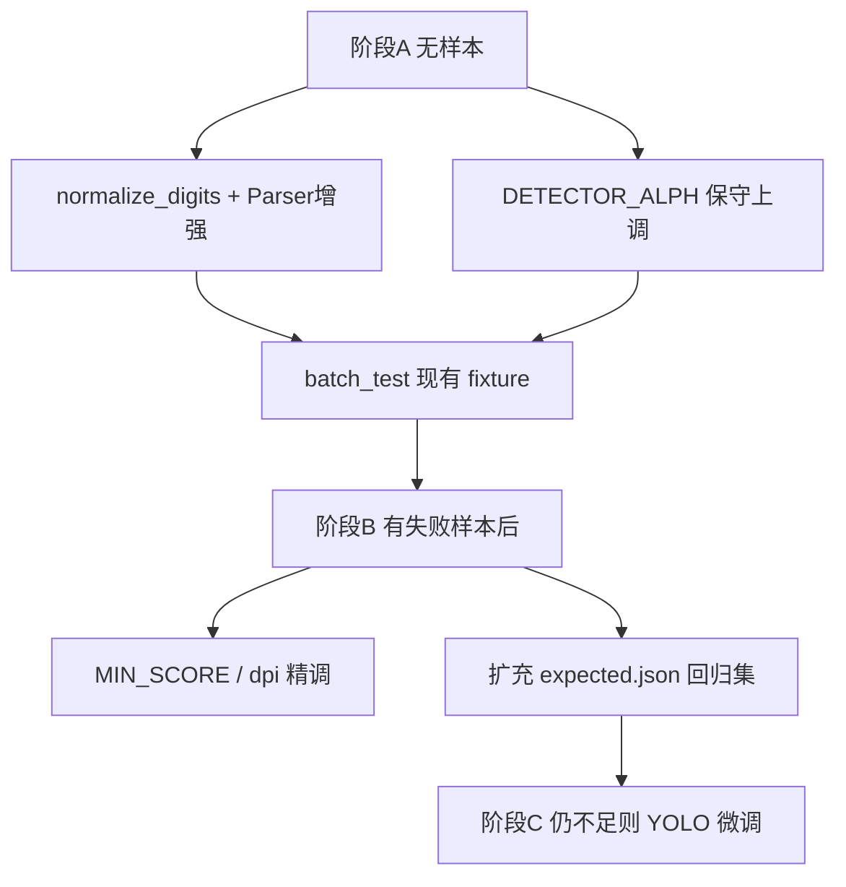
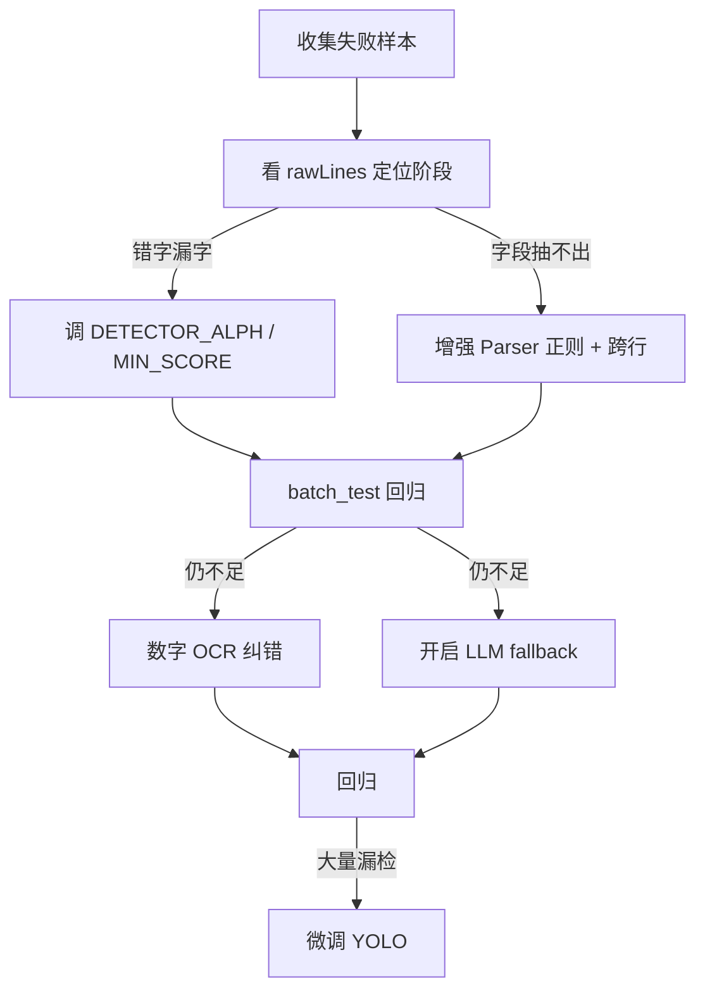

# OCR 识别准确度提升方案

**文档版本**：v1.0  
**更新日期**：2026-06-16  
**关联文档**：[技术文档](./技术文档.md)、[产品文档](./产品文档.md)

**概述**：针对「CRNN 错字/漏字」与「OCR 有文本但 fields 为空」两类问题，先建立分层诊断流程，再按成本从低到高依次应用检测调参、解析规则增强、OCR 纠错与 LLM 兜底，并用 batch_test 回归验证。

---

## 任务进度

| 阶段 | 任务 | 状态 |
|------|------|------|
| A | `base.py` 增加 normalize_digits；增强 vat_e/vat_m 全角冒号、跨行配对、数字纠错 | 已完成 |
| A | 保守调整 `model_post.py` DETECTOR_ALPH（electronic 0.15、machine 0.05） | 已完成 |
| A | 对现有 test/fixtures（digital_vat、unknown）跑 batch_test，确认无回归 | 待验证（需安装 opencv 等依赖并启动服务） |
| B | 按 test/fixtures/\<docType\>/ 组织失败样本 + expected.json | 待办 |
| B | （可选）有 API 后在 config/settings.yaml 开启 LLM fallback | 待办 |
| C | （需标注样本）微调 YOLO 检测模型 | 待办 |

---

## 1. 问题定位

当前流水线分四段，**必须先确定错在哪一段**，否则容易「改错地方」：


| 现象 | 失败阶段 | 典型原因 |
|------|----------|----------|
| `rawLines` 为空，code 104 | 检测或 CRNN | 漏检文字框、PDF 分辨率低、去红章误伤 |
| `rawLines` 有内容但错字/漏字 | CRNN 或检测框 | 框切偏、字符混淆（0/O、1/l）、小字号 |
| `rawLines` 大致正确，`fields` 空 | Parser 正则 | 标签变体、标签与值分行、OCR 噪声字符 |
| `docType` 不对 | 路由 | 关键词未覆盖或优先级冲突 |

**诊断步骤（零代码改动）：**

1. 调用 `POST /ocr-raw` 或查看响应中的 `data.rawLines`，确认 OCR 原文
2. 对比 `rawLines` 与期望字段，判断是「识别错」还是「解析抽不出」
3. 用 [scripts/batch_test.py](../scripts/batch_test.py) 对问题样本建 fixture，量化字段匹配率

---

## 2. 失败样本：目录组织与数据表示

### 2.1 目录结构（按票种分目录）

```
test/fixtures/
├── vat_e/                    # 增值税电子普票
│   ├── expected.json         # 本目录全部样本的期望结果
│   ├── 20240615_001.pdf      # 原始票据文件（jpg/png/pdf）
│   ├── 20240615_002.jpg
│   └── 20240615_001.meta.json  # 可选：诊断用 sidecar，batch_test 不读
├── vat_m/
├── digital_vat/
├── itinerary/
└── failures/                 # 可选：跨票种、尚未确认 docType 的样本
    ├── expected.json
    └── unclassified_001.pdf
```

**规则：**

- 样本文件与 `expected.json` **同级放置**（`batch_test.py` 只扫描目录顶层，不递归子目录）
- 按 **真实票种** 分目录；不确定时先放 `failures/`，确认 `docType` 后再迁移
- 文件名建议：`{日期或来源}_{简短描述}.{ext}`，避免中文路径（Windows 已支持，但便于 CI/脚本）
- 跳过规则：以 `RedThresh_` 开头、`.` 开头、非 jpg/png/pdf 的文件会被忽略

### 2.2 expected.json 格式（batch_test 可读）

支持三种写法，由 [scripts/batch_test.py](../scripts/batch_test.py) 的 `_resolve_expected` 解析：

**写法 1 — defaults + 逐文件 samples（推荐）**

```json
{
  "defaults": {
    "code": 100,
    "docType": "vat_e"
  },
  "samples": {
    "20240615_001.pdf": {
      "fields": {
        "发票代码": "044001900111",
        "发票号码": "12345678",
        "开票日期": "2024年06月15日",
        "税后金额": "128.00",
        "校验码": "12345678901234567890"
      }
    },
    "20240615_002.jpg": {
      "code": 100,
      "docType": "vat_e",
      "fields": {
        "发票号码": "87654321"
      }
    }
  }
}
```

**写法 2 — 文件名即 key（与写法 1 等价）**

```json
{
  "20240615_001.pdf": {
    "code": 100,
    "docType": "vat_e",
    "fields": { "发票号码": "12345678" }
  }
}
```

**写法 3 — samples 数组（含 file 字段）**

```json
{
  "samples": [
    {
      "file": "20240615_001.pdf",
      "code": 100,
      "docType": "vat_e",
      "fields": { "发票号码": "12345678" }
    }
  ]
}
```

**batch_test 实际比对的字段：**

| 键 | 是否必填 | 说明 |
|----|----------|------|
| `code` | 否 | 继承 `defaults`；100=成功，104=OCR 无文本 |
| `docType` | 否 | 继承 `defaults`；如 `vat_e`、`digital_vat` |
| `fields` | 否 | **键存在则精确字符串匹配**；空 `{}` 表示不断言字段 |
| `_comment` | — | 任意位置均可，脚本忽略 |

**fields 断言策略：**

- **只写你关心的字段**：未出现在 `fields` 里的键不会被校验（适合「只修发票号码」的回归）
- **全部字符串比较**：`str(actual) != str(expected)`，注意 `"128.00"` 与 `"128.0"` 会判 FAIL
- **code 104 样本**：`"fields": {}` 且 `"code": 104`，用于「必须识别出文字」的反面用例

### 2.3 失败类型标注（诊断用，batch_test 当前忽略）

在 `samples` 条目或 sidecar 中记录失败根因，便于分组改进：

```json
{
  "samples": {
    "20240615_001.pdf": {
      "code": 100,
      "docType": "vat_e",
      "fields": { "发票号码": "12345678" },
      "failureType": "missing_fields",
      "notes": "OCR 有「号码:12345678」但 Parser 未命中，缺全角冒号规则"
    }
  }
}
```

| failureType | 含义 | 对应改进路径 |
|-------------|------|-------------|
| `no_text` | rawLines 为空，code 104 | 检测调参 / PDF dpi / YOLO 微调 |
| `wrong_chars` | rawLines 有错字漏字 | DETECTOR_ALPH、normalize_digits |
| `missing_fields` | rawLines 可读，fields 空或不完整 | Parser 正则、跨行、LLM fallback |
| `wrong_doctype` | docType 路由错误 | doc_router 关键词 |

### 2.4 可选 sidecar：`{文件名}.meta.json`

当需要保留 OCR 原文便于人工对比、又不想让 `expected.json` 臃肿时：

```json
{
  "failureType": "wrong_chars",
  "notes": "号码第 3 位 O 被识别为 0",
  "rawLinesText": [
    "电子普通发票",
    "发票代码:044001900111",
    "发票号码:12345O678"
  ],
  "capturedAt": "2026-06-16",
  "source": "用户上报 #42"
}
```

- 由人工从 `/invoice-ocr` 或 `/ocr-raw` 响应复制 `rawLines[].text` 填入
- **不参与自动化断言**；修复后对照 meta 确认 OCR 是否改善
- 含敏感信息时勿提交 git，可加入 `.gitignore` 或使用脱敏副本

### 2.5 收集失败样本的操作流程



### 2.6 示例：两类典型失败样本

**解析失败（missing_fields）— 只断言缺失字段**

```json
{
  "defaults": { "code": 100, "docType": "vat_e" },
  "samples": {
    "dash_colon.pdf": {
      "fields": { "发票号码": "12345678" },
      "failureType": "missing_fields",
      "notes": "票面为「号码：12345678」全角冒号"
    }
  }
}
```

**OCR 错字（wrong_chars）— 期望值为人工校正后的真值**

```json
{
  "samples": {
    "blur_scan.jpg": {
      "code": 100,
      "docType": "vat_e",
      "fields": {
        "发票代码": "044001900111",
        "发票号码": "12345678"
      },
      "failureType": "wrong_chars",
      "notes": "当前 OCR 输出 12345O678，Parser 需 normalize_digits 或调检测框"
    }
  }
}
```

### 2.7 与 git / 隐私

- 票据含企业信息：**勿把生产真实发票提交公开仓库**；团队内库可提交，或只用脱敏截图
- `test/` 下上传缓存 `RedThresh_*` 不必纳入 fixture
- 样本量建议：每票种先 **5~10 张失败样本** 覆盖主要 failureType，再随修复扩充

---

## 3. 路径 A：CRNN 错字 / 漏字

### 3.1 A1. 低成本：检测与裁剪调参（优先尝试）

检测框不准是 CRNN 错字的首要原因。可调入口在 [model_post.py](../model_post.py)：

```python
DEFAULT_DETECT_PARAMS = dict(
    MAX_HORIZONTAL_GAP=50,
    MIN_V_OVERLAPS=0.6,
    MIN_SIZE_SIM=0.6,
    TEXT_PROPOSALS_MIN_SCORE=0.1,   # 降低 → 提高召回，可能增加误检
    TEXT_PROPOSALS_NMS_THRESH=0.3,
    TEXT_LINE_NMS_THRESH=0.7,
)

DETECTOR_ALPH = {
    'electronic': 0.1,   # 增大 → 检测框左右延伸，减少切字
    'machine': 0.01,
    'type': 0.01,
}
```

**建议调整顺序：**

1. 将目标票种对应 `DETECTOR_ALPH` 从 `0.1` 提到 `0.15~0.2`（减少左右切字）
2. 若小字漏检，将 `TEXT_PROPOSALS_MIN_SCORE` 从 `0.1` 降到 `0.05`（注意：非发票图片可能误检暴增，见 [app.py](../app.py) 去红章注释）
3. 机打票可增大 `DETECTOR_TEXT_DETECT_GAP['machine']`（当前 30），改善行合并

### 3.2 A2. 输入质量：PDF 与预处理

- PDF 转图当前 `dpi=200`（[app.py](../app.py) → `pdf_to_jpg`），小字号票据可试 **300 dpi**
- 确认 [config.py](../config.py) 中 `DETECTANGLE=True`，避免倾斜导致识别差
- 增值税票才需要 `remove_stamp`；非发票票种已在 `DOC_TYPES` 中设为 `remove_stamp: False`，避免 RedThresh 噪点

### 3.3 A3. 中等成本：OCR 后纠错（针对数字字段）

对发票代码/号码/校验码等**纯数字字段**，可在 Parser 层增加轻量纠错，不改动 CRNN 模型：

- 常见混淆映射：`O→0`、`l/I→1`、`S→5`、`B→8`
- 仅对 `\d+` 字段应用，避免污染中文标签
- 实现位置：[application/parsers/base.py](../application/parsers/base.py) 增加 `normalize_digits(text)` 工具，各 Parser 在正则匹配前调用

### 3.4 A4. 高成本：微调 YOLO 检测模型

CRNN（`ocr-lstm.pth`）为通用中文模型，**通常不重训**。若 A1~A3 后仍大量漏字：

- 判定标准：某票种 `rawLines` 漏检率 > 30%，或降阈值后仍缺关键行
- 流程：LabelImg 标注文字框（100~300 张/类）→ 基于 [text/keras_detectE_invoice.py](../text/keras_detectE_invoice.py) 微调 → 新权重挂到 [config.py](../config.py) `DOC_TYPES[xxx]['detector']`

---

## 4. 路径 B：OCR 有文本但 fields 抽不出

### 4.1 B1. 增强 Parser 正则（首选，改动小）

现有 [application/parsers/vat_e.py](../application/parsers/vat_e.py) 规则较严格，例如：

```python
res = re.findall('代码:\d*', txt)
res += re.findall('代码\d*', txt)
```

**常见问题与对策：**

| OCR 实际输出 | 现有规则 | 改进方向 |
|-------------|---------|---------|
| `代码：1234567890`（全角冒号） | 只匹配半角 `:` | 加 `[:：]` |
| `代 码` / `代碼`（空格/繁体） | 精确匹配 `代码` | 加容错 `[代碼\s]*` |
| 标签与值分两行 | 单行正则 | 邻行配对 |
| `号码01234567`（OCR 把 O 识别为 0） | 严格 `\d*` | 先 normalize_digits 再匹配 |

**参考更宽松写法**：[application/parsers/digital_vat.py](../application/parsers/digital_vat.py) 已使用 `[:：]?`、跨标签模式，可迁移到 `vat_e` / `vat_m`。

### 4.2 B2. 跨行字段提取

发票版式常把「发票号码」标签与 8 位数字分两行。在 Parser 中增加逻辑：

```python
# 伪代码：当前行含标签，下一行含纯数字
if re.search(r'号码', txt) and i + 1 < N:
    next_txt = normalize_digits(self.lines[i+1]['text'])
    m = re.search(r'\d{8,20}', next_txt)
```

实现位置：各 Parser 的 `number()` / `code()` 方法，利用 `union_rbox` 合并后的 `self.lines` 顺序（vat_e 已调用 `union_rbox(ocr_lines, 0.2)`）。

### 4.3 B3. 启用 LLM 结构化兜底（已有代码，配置即用）

当 Parser 返回空且 `docType != unknown` 时，[app.py](../app.py) 会调用 [application/llm_fallback.py](../application/llm_fallback.py)：

```python
if not fields:
    settings = get_settings()
    llm_cfg = settings.get('llm_fallback', {})
    if llm_cfg.get('enabled') and doc_type != 'unknown':
        fields = fallback(doc_type, raw_lines, llm_cfg) or {}
```

在 [config/settings.yaml](../config/settings.yaml) 中开启：

```yaml
llm_fallback:
  enabled: true
  api_url: "https://your-api/v1/chat/completions"  # OpenAI 兼容
  api_key: "sk-..."
  model: "gpt-4o-mini"
```

**适用场景**：OCR 文本可读但正则难以穷举变体；**不适用**：`rawLines` 本身严重缺失。

### 4.4 B4. 票种路由修正（若 docType 错误导致 Parser 不匹配）

检查 [application/doc_router.py](../application/doc_router.py) 关键词优先级；路由错会导致调用错误的 Parser（如数电票走了 `vat_e`）。

---

## 5. 推荐实施顺序

### 5.1 阶段 A：无需失败样本（可立即执行）

当前没有整理好的错误数据时，先做以下**基于已知版式/文档的通用改进**，不依赖 fixture 回归：

| 任务 | 文件 | 依据 | 风险 |
|------|------|------|------|
| 数字 OCR 纠错工具 | application/parsers/base.py | 路径 A3：O/I/l→数字 | 低，仅作用于数字提取 |
| Parser 规则增强 | vat_e.py、vat_m.py | 路径 B1/B2：全角冒号、跨行、参考 digital_vat | 低，只放宽匹配 |
| 检测框延伸（保守） | model_post.py `DETECTOR_ALPH` | 路径 A1：electronic 0.1→0.15，machine 0.01→0.05 | 中低，可能略增误检 |
| smoke 验证 | test/fixtures/digital_vat、unknown | 目录内已有 sample.jpg | — |

**阶段 A 暂不做（需样本或副作用大）：**

- `TEXT_PROPOSALS_MIN_SCORE` 下调（误检风险高，需失败样本验证）
- PDF dpi 改 300（需对比样本）
- LLM fallback 开启（需 API + 样本验收）
- YOLO 微调（需标注数据）



**阶段 A 具体改动清单：**

1. `base.py`：`normalize_digits(text)` —— `O/o→0`, `l/I/i→1`, `S/s→5`, `B/b→8`（仅用于 `\d` 匹配前）
2. `vat_e.py`：
   - 标签正则加 `[:：]`、空格容错
   - `code`/`number`/`check_code` 匹配前 normalize_digits
   - 标签行与下一行数字跨行配对
   - 金额支持 `¥` 全角符号
3. `vat_m.py`：
   - 数字字段匹配前 normalize_digits
   - 日期/金额模式参考 vat_e 放宽
4. `model_post.py`：`DETECTOR_ALPH['electronic']=0.15`, `['machine']=0.05`

**阶段 A 验证命令：**

```bash
python scripts/batch_test.py --dir test/fixtures/digital_vat
python scripts/batch_test.py --dir test/fixtures/unknown
```

### 5.2 阶段 B：有失败样本后

1. 整理 fixture + `expected.json`（见 §2）
2. 针对 failureType 精调 `TEXT_PROPOSALS_MIN_SCORE`、PDF dpi
3. 可选开启 LLM fallback
4. 字段匹配率目标 ≥ 90%

### 5.3 阶段 C：rawLines 仍大量缺失

针对问题票种微调 YOLO 检测权重。

### 5.4 完整流程（供参考）



---

## 6. 验收标准

- 回归集字段匹配率：核心字段（发票号码、日期、金额）**≥ 90%**
- code 104 比例：仅保留真正无文字的样本
- 单张识别耗时增幅：调参后不超过基线 20%；LLM 兜底可异步或按需开启

---

## 7. 关键文件索引

| 文件 | 改动类型 |
|------|----------|
| [model_post.py](../model_post.py) | 检测阈值、框延伸 |
| [application/parsers/](../application/parsers/) | 正则增强、跨行、数字纠错 |
| [application/parsers/base.py](../application/parsers/base.py) | 共用 normalize 工具 |
| [config/settings.yaml](../config/settings.yaml) | LLM fallback 开关 |
| [app.py](../app.py) | PDF dpi（若需） |
| [test/fixtures/](../test/fixtures/) | 失败样本 + expected.json |
| [scripts/batch_test.py](../scripts/batch_test.py) | 回归验证 |

---

**文档维护**：实施阶段 A/B/C 或调整 fixture 规范时同步更新本文档。
